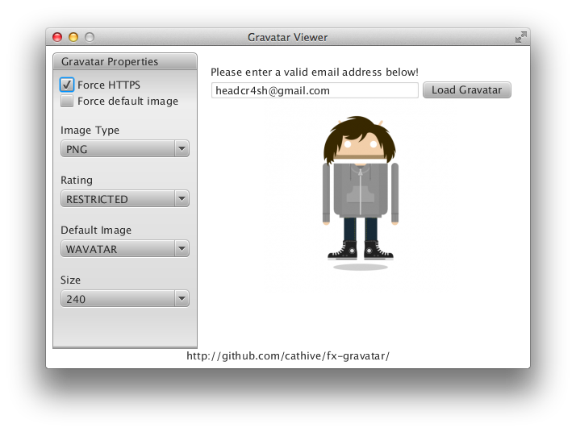

fx-gravatar
===========

[](https://travis-ci.org/cathive/fx-gravatar)

This library provides a nice API to be used in conjunction with
so-called globally recognized avatars, which are available from
www.gravatar.com

It also provides a little example application , the "Gravatar Viewer"
to demonstrate it's usage with JavaFX.



A compiled and ready-to-use version of this library can be found in the
Sonatype OSS Maven Repository (oss.sonatype.org). To use the library
in your Maven based projects just add the following lines to your
'pom.xml':

```xml
<dependency>
  <groupId>com.cathive.fx</groupId>
  <artifactId>fx-gravatar</artifactId>
  <version>${fx-gravatar.version}</version>
</dependency>
```
